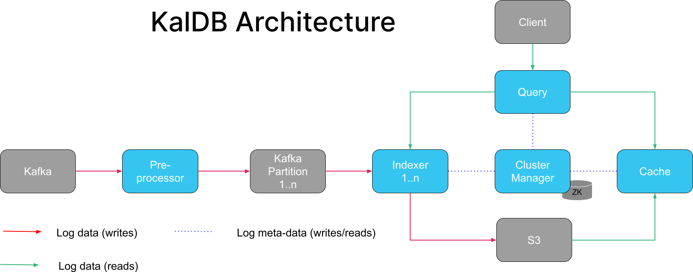

# KalDB

KalDB is a cloud-native search engine for log management & analytics. It is designed to be very cost-effective, easy to operate, and scale to petabytes.

[Join our Slack community](https://join.slack.com/t/kaldb/shared_invite/zt-1om21f1yv-jyRUCH1JO6g6HMlKgd8mDw)

# 💡 Features

- Index data persisted on object storage(S3).
- No delayed logs: Prioritizes ingesting fresh data over older data.
- Dynamic schema: Ingest JSON documents with or without a strict schema
- Cloud-native: Kubernetes ready
- Plug-in for [Grafana UI](https://github.com/slackhq/slack-kaldb-app). 
- Designed to elastically scale to handle log spikes automatically.
- Based on Apache Lucene.
- Works out of the box with sensible defaults
- Built-in multi-tenancy so you don't have to run multiple clusters.
- Co-ordination free ingestion, so failure of a single node doesn't stop ingestion.
- Designed for zero data loss. 
- Distributed search
- Add and remove nodes in seconds. Elastically scale capacity up and down based on load.
- Decoupled compute & storage
- Ingest your documents with exactly-once semantics
- Kafka-native ingestion

# 🔎 Uses & Limitations
| :white_check_mark: &nbsp; When to use                                                  	                                                    | :x: When not to use                                       	|
|---------------------------------------------------------------------------------------------------------------------------------------------|--------------------------------------------------------------	|
| Your documents are immutable: application logs, system logs, access logs, user actions logs, audit trail  (logs), etc.                    	 | Your documents are mutable.   	|
| Your data has a time component. KalDB includes optimizations and design choices specifically related to time.                               | You need a low-latency search for e-commerce websites.               	|
| You want a full-text search in a multi-tenant environment.     	                                                                            | You provide a public-facing search with high QPS.	|
| You want to index directly from Kafka.                                                                                                      | You want to re-score documents at query time.
| You ingest a tremendous amount of logs and don't want to pay huge bills.                                                             	      |
| You ingest a tremendous amount of data and you don't want to waste your precious time babysitting your ElasticSearch cluster.                             

# 🎨  Design



# 💬 Community
## Talks
[KalDB: A k8s native log search platform](https://www.youtube.com/watch?v=soC04dpOQEM&t=9391s)

# 🙋 FAQ

### How is KalDB different from traditional search engines like Elasticsearch or Solr?
The core difference and advantage of KalDB is its architecture that is built from the ground up for cloud and log management. KalDB prioritizes indexing fresh logs over older logs, so your logs are never behind. Thanks to the true decoupled compute and storage, search instances are stateless, it is possible to auto-scale capacity within seconds. Last but not least, we implemented a highly-reliable distributed search and exactly-once semantics during indexing so that all engineers can sleep at night. To is cheaper than ES since we implement a tiered storage API, and on-demand restores.

# ⚡ Getting Started

To build the binary: `mvn clean package`

### Local development

> IntelliJ: Import the project as a Maven project.

IntelliJ run configs are provided for all node types, and execute using the provided `config/config.yaml`. These 
configurations are stored in the `.run` folder and should automatically be detected by IntelliJ upon importing the 
project.

To start the application dependencies (Zookeeper, Kafka, S3) you can use the provided docker compose file:
```bash
docker-compose up
```
