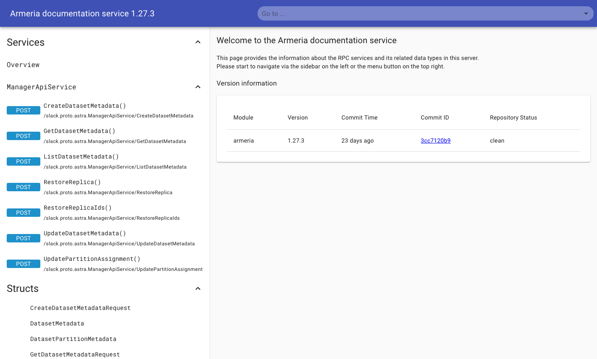
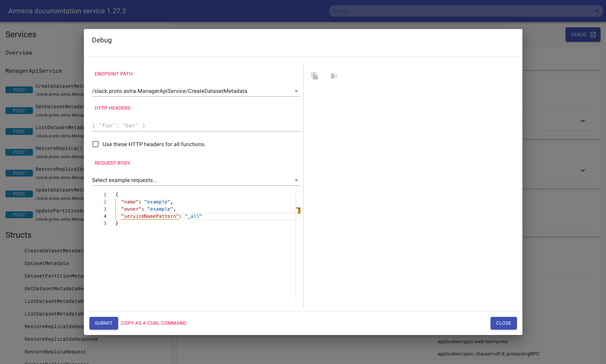
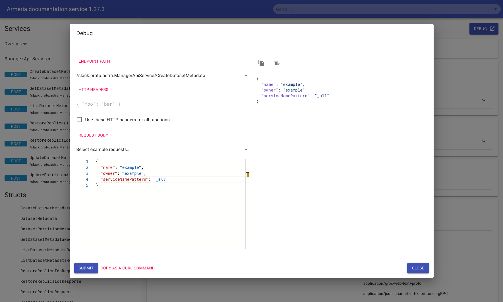
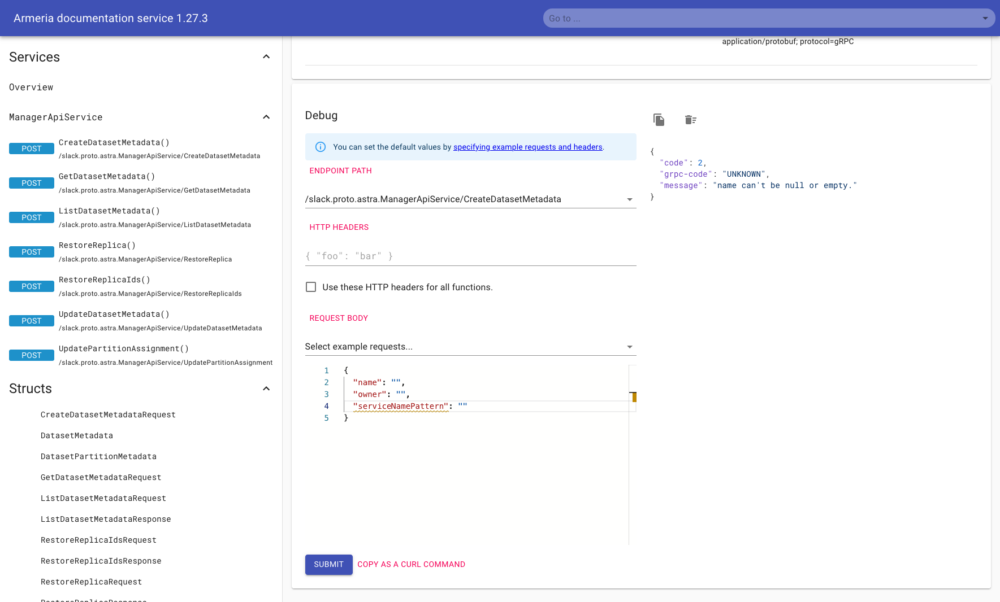

# Admin UI

A simplified administration UI is provided by the manager node, providing easy access to the 
[manager api operations](API-manager.md). 

## DocService

The DocService is an admin UI automatically generated from the protobuf definitions 
[via Armeria](https://armeria.dev/docs/server-docservice/). This service can be accessed at the `/docs` path at the 
manager IP.

<tip>Consider registering your manager nodes with a service discovery tool to provide a consistent address for 
your administration tooling.</tip>

<tip>No service is bound to the root path of the manager service. Make sure to include the complete <code>/docs</code> 
path to avoid getting the service error response.
<code-block>
Status: 404
Description: Not Found
</code-block>
</tip>

{border-effect="line" width="700" thumbnail="true"}
_Manager DocService page_

### Using the debug UI

The debug UI will automatically populate an example request body stub that can be used to help prepare a request. Note
that this example is not always valid, as certain fields may be required that are not automatically populated.

Invoking the debug dialog can be done with an overlay using the <path>debug</path> button, or is additionally provided 
at the bottom of a service description page. Submitting a request in the UI will render the response, along with any 
error messages that may have occurred.

{border-effect="line" width="700" thumbnail="true"}
_Example before submitting a DocService request_

{border-effect="line" width="700" thumbnail="true"}
_Example with a successful DocService request_

{border-effect="line" width="700" thumbnail="true"}
_Example with an error DocService request_