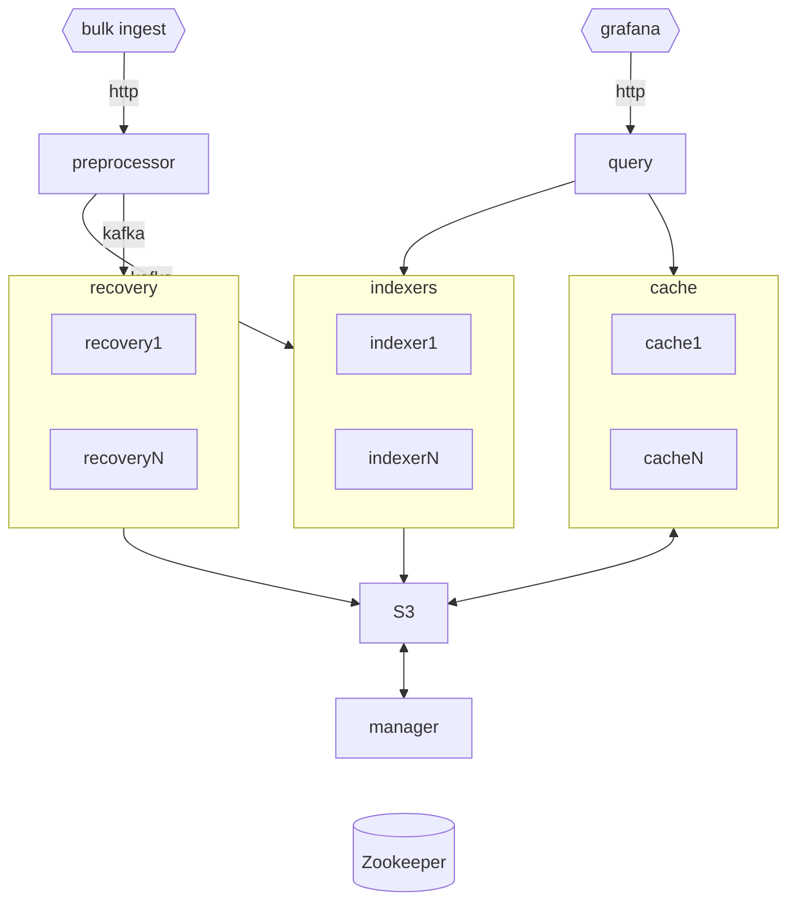

# Architecture

Design goals, system components, and data architecture for Astra.

## Goals
Astra is a cloud-native search and analytics engine for log, trace, and audit data. It is designed to be easy to operate,
cost-effective, and scale to petabytes of data.

<tabs>
<tab title="Goals">

- Native support for log, trace, audit use cases.
- Aggressively prioritize ingest of recent data over older data.
- Full-text search capability.
- First-class Kubernetes support for all components.
- Autoscaling of ingest and query capacity.
- Coordination free ingestion, so failure of a single node does not impact ingestion.
- Works out of the box with sensible defaults.
- Designed for zero data loss.
- First-class Grafana support with [accompanying plugin](https://github.com/slackhq/slack-astra-app).
- Built-in multi-tenancy, supporting several small use-cases on a single cluster.
- Supports the majority of Apache Lucene features.
- Drop-in replacement for most OpenSearch log use cases.
</tab>
<tab title="Non-goals">

- General-purpose search cases, such as for an ecommerce site.
- Document mutability - records are expected to be append only.
- Additional storage engines other than Lucene.
- Support for JVM versions other than the current LTS.
- Supporting multiple Lucene versions.
</tab>
</tabs>

## System overview
Astra is a [Lucene](https://lucene.apache.org) based log search engine built using an architecture similar to the [Aggregator/Leaf/Tailer pattern](https://rockset.com/blog/aggregator-leaf-tailer-an-architecture-for-live-analytics-on-event-streams/).
This approach allows us to separate the compute from durability and storage. The durability of
non-indexed data is provided by Kafka, and the storage for indexed data is provided by S3.

Since Astra indexers are stateless, we can dynamically scale indexer nodes during peak hours to guarantee real-time
ingestion of logs. This helps us tackle the peak ingestion, and prioritize ingesting fresh logs over older logs.

## Twitter LogLens

The Astra architecture largely follows an internal approach developed at Twitter around 2015 named 
[LogLens](https://blog.x.com/engineering/en_us/a/2016/observability-at-twitter-technical-overview-part-ii). A few key 
differences with Astra to this architecture revolve around using S3 instead of HDFS, and leveraging OpenSearch for the 
query engine. 

> "The LogLens service was designed around the following prioritizations [sic] — ease of onboarding, prioritizing availability of “live” logs over cost, prioritizing cost over availability for older logs, and the ability to operate the service reliably with limited developer investment."

LogLens was [discontinued at Twitter](https://blog.x.com/engineering/en_us/topics/infrastructure/2021/logging-at-twitter-updated) around 2021 in favor of Splunk, due to "limited resource investment".

> Unsurprisingly, a logging system with such limited resource investment ultimately fell short of users’ expectations, and the system saw suboptimal adoption by developers at Twitter.

> ...it was limited by low ingestion capacity and limited query capabilities, which resulted in poor adoption and failed to deliver the value we hoped for.

<deflist>
<def title="LogLens architecture">

</def>
</deflist>

<seealso>
       <category ref="external">
           <a href="https://blog.x.com/engineering/en_us/a/2016/observability-at-twitter-technical-overview-part-ii">
Observability at Twitter: technical overview, part II</a>
            <a href="https://blog.x.com/engineering/en_us/topics/infrastructure/2021/logging-at-twitter-updated">Logging at Twitter: Updated</a>
       </category>
</seealso>