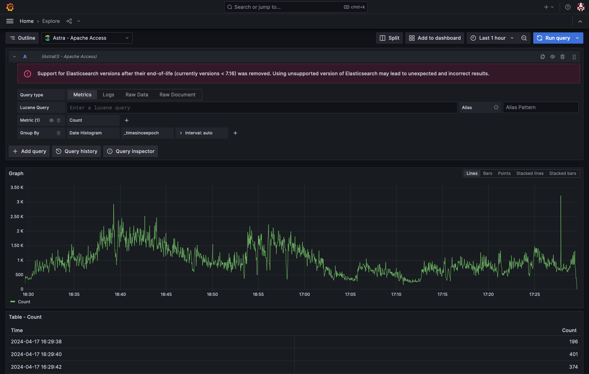

# Logs

Using the Astra Grafana app and ElasticSearch datasource compatibility modes to search logs.

## Full-text search

Astra enables full-text search via the [indexerConfig.luceneConfig.enableFullTextSearch](Config-options.md#luceneconfig)
config option. Enabling this parameter will additionally index all content to an `_all` field, which then is set as the 
default query field when none are specified in the query.

<tip>Full-text search will result in more disk usage, due to the additional field indexing.</tip>

## Regex support

Astra does not currently support regex (_regexp_) style queries. 

## Astra Grafana App
[https://github.com/slackhq/slack-astra-app](https://github.com/slackhq/slack-astra-app)

{border-effect="line" width="700" thumbnail="true"}
<note>
    The Astra Grafana app is not currently 
    <a href="https://grafana.com/developers/plugin-tools/publish-a-plugin/sign-a-plugin">signed with Grafana
    </a>, which will result in a warning indicating an invalid signature and necessitates enabling unsigned 
    plugins.
</note>

<procedure title="Installing the Astra Grafana app" collapsible="true" default-state="expanded">
    <step>
        Download the latest <code>zip</code> release from the 
        <a href="https://github.com/slackhq/slack-astra-app/releases">Github releases page</a>.
    </step>
    <step>
        Extract the <code>zip</code> to your Grafana plugins folder. 
        <tip>The default location for Grafana plugins is <path>/var/lib/grafana/plugins/</path></tip>
    </step>
    <step>
        Enable unsigned plugins for both included Astra plugins: <code>slack-astra-app</code>, and 
        <code>slack-astra-app-backend-datasource</code>
        <tabs>
            <tab title="Configuration file">
                <tip>Depending on your OS, your custom configuration file is either the 
                <path>$WORKING_DIR/conf/custom.ini</path> file or the <path>/usr/local/etc/grafana/grafana.ini</path>
                file.
                </tip>
                 
                <code-block lang="ini">
                    [plugins]
                    allow_loading_unsigned_plugins = "slack-astra-app,slack-astra-app-backend-datasource"
                </code-block>
            </tab>
            <tab title="Environment variable">
                <deflist>
                <def title="terminal">
                    <code-block lang="bash">
                        export GF_PLUGINS_ALLOW_LOADING_UNSIGNED_PLUGINS="slack-astra-app,slack-astra-app-backend-datasource"
                    </code-block>
                </def>
                <def title="docker-compose">
                    <code-block lang="yaml">
                        environment:
                            GF_PLUGINS_ALLOW_LOADING_UNSIGNED_PLUGINS: "slack-astra-app,slack-astra-app-backend-datasource"
                    </code-block>
                </def>
                </deflist>
            </tab>
        </tabs>
    </step>
    <step>
        On starting Grafana, a log warning message should be emitted indicating that it is running the unsigned plugins
        <code-block>
            WARN[06-01|16:45:59] Running an unsigned plugin pluginID=slack-astra-app
        </code-block>
    </step>
    <step>
        Navigate your Grafana install to <path>Administration / Plugins and data / Plugins </path> to enable the Astra 
        plugin.
        
    </step>
</procedure>

{border-effect="line" width="700" thumbnail="true"}
_Astra explore UI_

## ElasticSearch compatibility mode

When using Grafana, you can point an existing ElasticSearch datasource to an Astra install to run in a limited 
compatibility mode. Not all aggregations listed in the Grafana UI will be supported when running in this mode.

<tip>Due to version validation performed in Grafana against the <a href="API-opensearch.md#query-node-apis">cluster metadata endpoint</a>, a warning will be 
displayed about unsupported ElasticSearch versions.</tip>

{border-effect="line" width="700" thumbnail="true"}
