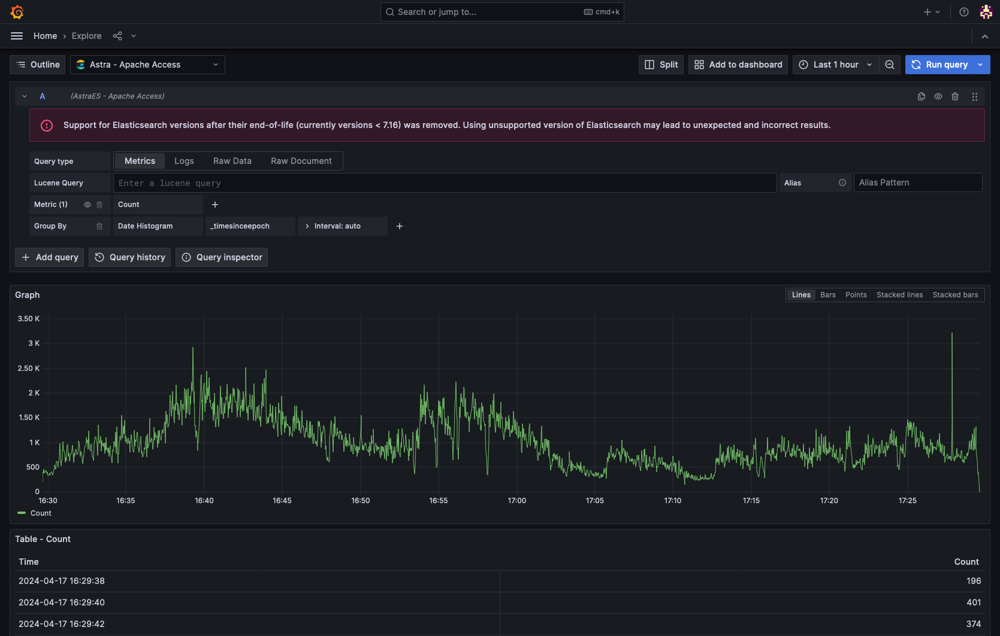

<show-structure for="chapter,procedure" depth="2"/>

# Migrating

Strategies for migrating from OpenSearch or ElasticSearch to Astra.

## Compatibility modes

### Logstash

The [Astra ingest API](API-opensearch.md#preprocessor-node-apis) is largely compatible as an ElasticSearch output from 
Logstash. Logstash requires several endpoints to be available in order to successfully produce messages, including the 
bulk ingest endpoint (<path>/_bulk</path>), the cluster metadata endpoint (<path>/</path>), and a license discovery 
endpoint (<path>/_license</path>).

While Astra does provide a bulk ingest and cluster metadata endpoint that are compatible with Logstash, a license 
discovery endpoint is not included. Similar functionality to this endpoint may be achieved using a proxy like Envoy with
a
[generic proxy filter](https://www.envoyproxy.io/docs/envoy/latest/configuration/listeners/network_filters/generic_proxy_filter) 
or a 
[direct response filter](https://www.envoyproxy.io/docs/envoy/latest/configuration/listeners/network_filters/direct_response_filter).

```
output {
  elasticsearch {
    hosts => ["10.0.0.1:10909"]
    id => "example-astra-cluster"
    index => "example-astra-index"
    data_stream => "false"
    ilm_enabled => "false"
    manage_template => "false"
    compression_level => 0
  }
}
```

<deflist type="medium">
<def title="hosts (required)">
The endpoint(s) to your Astra cluster.
</def>
<def title="data_stream (required)">
Astra compatibility mode does not support the <code>data_stream</code> configuration, and must be set to 
<code>false</code>.
</def>
<def title="compression_level (required)">
Astra compatibility mode does not support the <code>compression_level</code> configuration, and must be set to 
<code>0</code>.
</def>
<def title="id (recommended)">
Unique ID for this plugin instance.
</def>
<def title="index (optional)">
The index to write to in Astra.
</def>
<def title="ilm_enabled (ignored)">
Astra compatibility mode does not support the <code>ilm_enabled</code> configuration, and this setting is ignored.
</def>
<def title="manage_template (ignored)">
Astra compatibility mode does not support the <code>manage_template</code> configuration, and this setting is ignored.
</def>
</deflist>

### Grafana ElasticSearch

When using Grafana, you can point an existing ElasticSearch datasource to an Astra install to run in a limited
compatibility mode. Not all aggregations listed in the Grafana UI will be supported when running in this mode.

<tip>Due to version validation performed in Grafana against the <a href="API-opensearch.md#query-node-apis">cluster metadata endpoint</a>, a warning will be 
displayed about unsupported ElasticSearch versions.</tip>

{border-effect="line" width="700" thumbnail="true"}