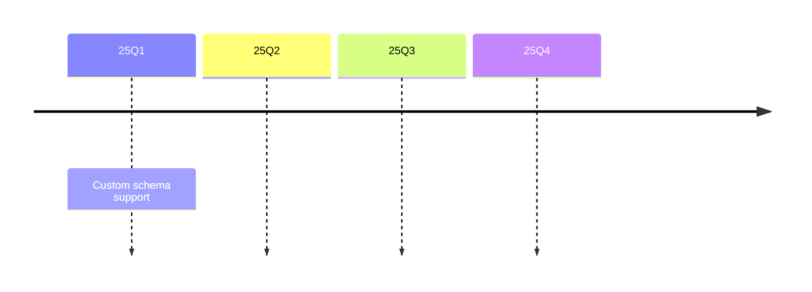
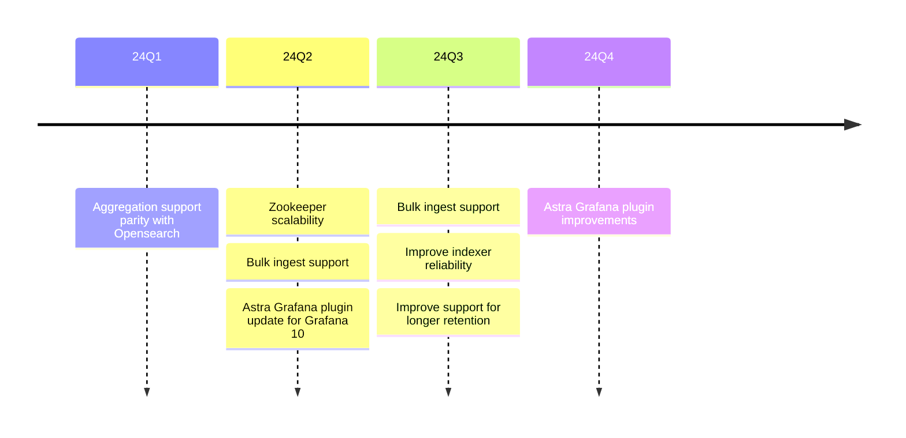

# Roadmap

Historic and planned project quarterly milestones. 

## 2025

* **Feb 2024 - April 2025** _25Q1_
  * [Custom schema support](https://github.com/slackhq/astra/milestone/6)

## 2024

* **Feb 2023 - April 2023** _24Q1_
  * [Aggregation support parity with Opensearch](https://github.com/slackhq/astra/milestone/3)
* **May 2023 - July 2023** _24Q2_
  * [Zookeeper scalability](https://github.com/slackhq/astra/milestone/1)
  * [Bulk ingest support](https://github.com/slackhq/astra/milestone/2)
  * Astra Grafana plugin update for Grafana 9/10
* **August 2023 - October 2023** _24Q3_
  * [Bulk ingest support](https://github.com/slackhq/astra/milestone/2)
  * [Improve indexer reliability](https://github.com/slackhq/astra/milestone/4)
  * [Improve support for longer retention](https://github.com/slackhq/astra/milestone/5)
* **November 2023 - January 2024** _24Q4_
  * [Astra Grafana plugin improvements](https://github.com/slackhq/slack-astra-app/milestone/1)
