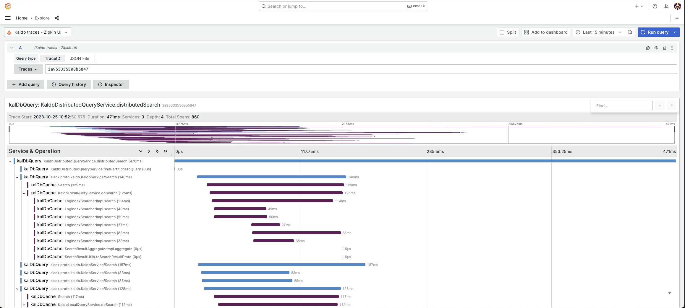
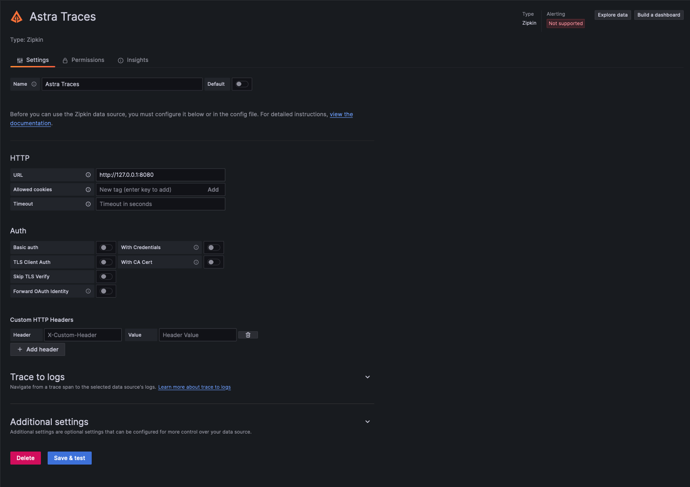
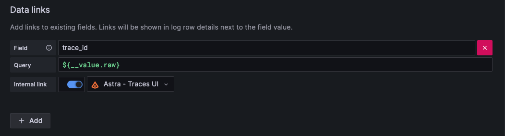
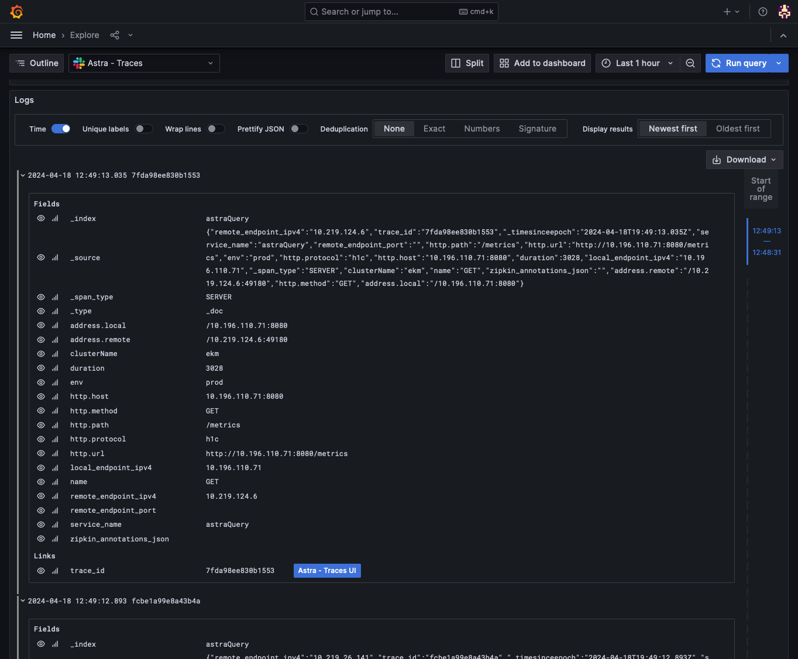

<show-structure for="chapter,procedure" depth="2"/>

# Traces

How to use the Zipkin compatible API to search and render traces with Astra using Grafana.

## Indexing schema

In order to render traces using the [Zipkin compatible API](API-zipkin.md), the following fields should be present at index time.

<deflist type="medium">
<def title="_timesinceepoch">Epoch time in milliseconds</def>
<def title="trace_id">Unique trace ID</def>
<def title="service_name">String identifying producing service</def>
<def title="name">String identifying the span</def>
<def title="duration">Duration in milliseconds</def>
</deflist>

## Grafana trace visualization

{border-effect="line" width="700" thumbnail="true"}

_Example trace from Astra, rendered in Grafana_

### Zipkin datasource configuration
When using Grafana 10 you can directly connect a Zipkin datasource to your Astra installation.

{border-effect="line" width="700" thumbnail="true"}

<deflist type="medium">
<def title="Required fields">

**URL** - Astra address, accessible by Grafana
</def>
</deflist>

### Astra data links

To enable quick toggling between Trace logs visualizations and waterfall, add a data link to your Astra traces
datasource that contains an internal link to the Astra zipkin datasource.

{border-effect="line" width="700" thumbnail="true"}

<deflist type="medium">
<def title="Field">
<code>trace_id</code>
</def>
<def title="Query">
<code>${__value.raw}</code>
</def>
<def title="Internal link">
<code>true</code> 
</def>
</deflist>

{border-effect="line" width="700" thumbnail="true"}

_Example data link from Astra to Zipkin datasource_

<seealso>
       <category ref="related">
            <a href="API-zipkin.md" />
        </category>
</seealso>