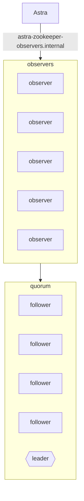

# Zookeeper

Astra uses Zookeeper as a metadata store accessible by all components, with Apache Curator recipes wrapping all 
major node operations.

## Recommended architecture

* Five nodes in quorum
* Observers serving all direct client traffic
    * Quorum members excluded from DNS, only serving forwarded observer requests




## Recommended configs

### znode.container.maxNeverUsedIntervalMs
This is the amount of time a container can exist without children before it is eligible for deleting. This happens when a node crashes while attempting to create a znode, and only the parent is left (partitioned metadata stores).

```
znode.container.maxNeverUsedIntervalMs=10000
```

> znode.container.maxNeverUsedIntervalMs : (Java system property only) New in 3.6.0: The maximum interval in milliseconds that a container that has never had any children is retained. Should be long enough for your client to create the container, do any needed work and then create children. Default is "0" which is used to indicate that containers that have never had any children are never deleted.

[https://zookeeper.apache.org/doc/r3.6.1/zookeeperAdmin.html#sc_performance_options](https://zookeeper.apache.org/doc/r3.6.1/zookeeperAdmin.html#sc_performance_options)

Note this is a Java system property, and must be set similar to the following:

```java
exec java -cp "$CLASSPATH" \
-Dznode.container.maxNeverUsedIntervalMs=10000 \
-XX:+UseG1GC -XX:MaxGCPauseMillis=200 -Xms2g -Xmx2g \
org.apache.zookeeper.server.quorum.QuorumPeerMain "$@"
```

## Troubleshooting

### jute.maxbuffer

Zookeeper is designed for small files, and not a large amount of them per path. This is enforced with a file size limit, that will return an error when attempting to read values larger than this configured amount. This error will typically occur when attempting to list children on a specific path, and can exceed the configure jute.maxbuffer.

The default `jute.maxbuffer` value for Zookeeper is 1MB. Changes to this limit should be made on both the server and clients. For additional documentation, Solr provides an excellent writeup about this - [https://solr.apache.org/guide/7_4/setting-up-an-external-zookeeper-ensemble.html](https://solr.apache.org/guide/7_4/setting-up-an-external-zookeeper-ensemble.html).


<seealso>
       <category ref="external">
          <a href="https://curator.apache.org/docs/about/">Apache Curator</a>
          <a href="https://zookeeper.apache.org/doc/r3.9.2/zookeeperAdmin.html">ZooKeeper Administrator's Guide</a>
          <a href="https://medium.com/airbnb-engineering/migrating-kafka-transparently-between-zookeeper-clusters-e68a75062f65">Migrating Kafka transparently between Zookeeper clusters</a>
          <a href="https://blog.twitter.com/engineering/en_us/topics/infrastructure/2018/zookeeper-at-twitter">ZooKeeper at Twitter</a>
       </category>
</seealso>
